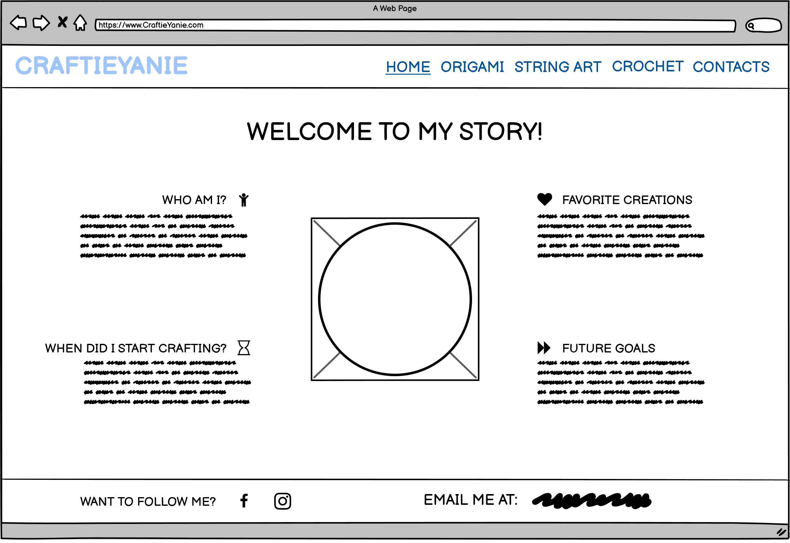
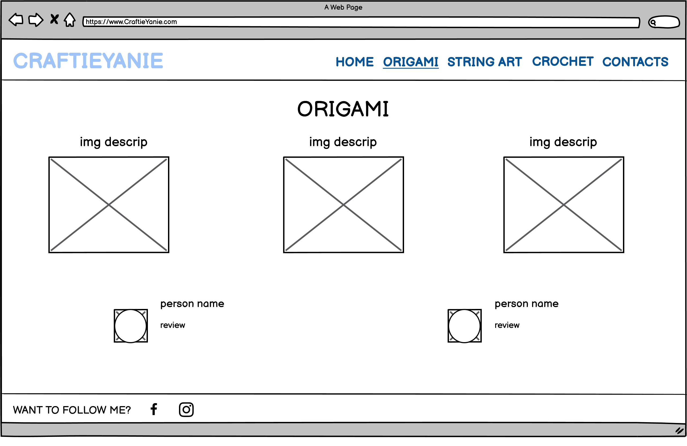
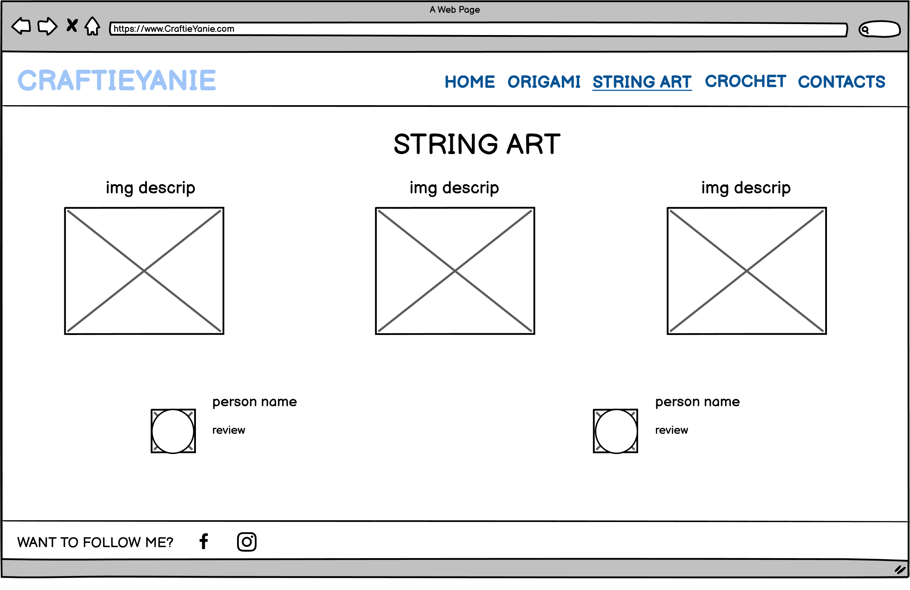
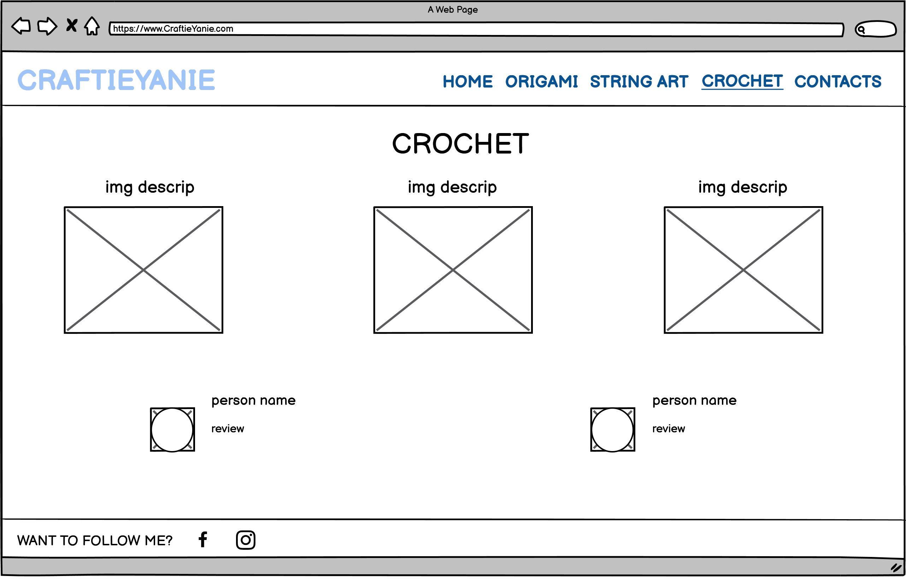
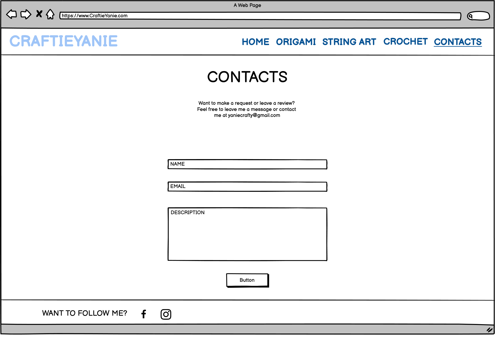

# User Experience (UX)
1- User Stories
     
     1.1-As a costumer/reguler user  
        1.1.1- As a costumer/reguler user I need to navigate easily and fluidly through the website;
        1.1.2- As a costumer/reguler user I want to easily recognise who the crafter is;
        1.1.3- As a costumer/reguler user I must be able to see and analise crafters previous projects;
        1.1.4- As a costumer/reguler user I should be able to read reviews on products;
        1.1.5- As a costumer/reguler user I require an easy way to contact the crafter for reviews or requests.
     1.2-As a business/crafter user
        1.2.1- As a business/crafter user I must be able to suggest projects to the crafter;
        1.2.2- As a business/crafter user I should be able to read reviews to assess product's quality;

2- Wireframes
    2.1-Homepage Wireframe 
     
    2.2-Origami page Wireframe
     
    2.3-String Art page Wireframe
     
    2.4-Crochet page Wireframe
     
    2.5-Contact page Wireframe
     
